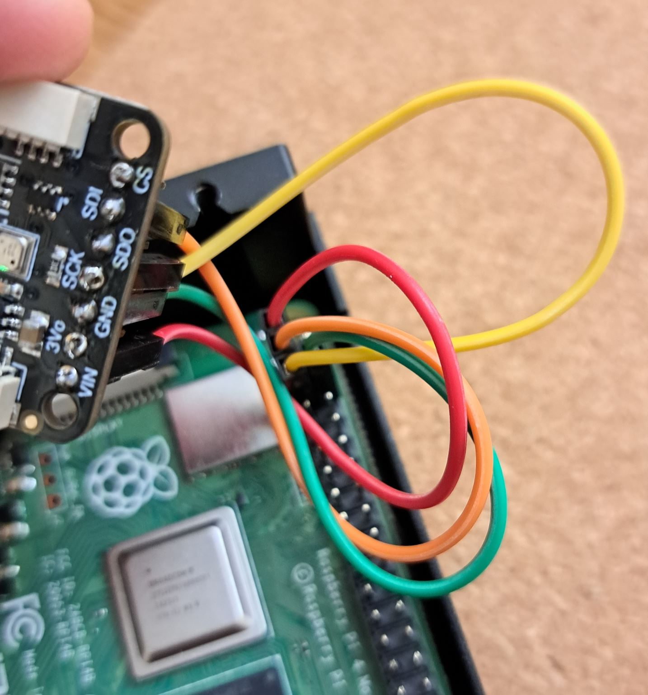

# Airsense

Basic project to read & visualize sensor data from a [Bosch BME680](https://www.bosch-sensortec.com/products/environmental-sensors/gas-sensors/bme680/) in Rust. Heavily based on [bosch-bme680 crate](https://crates.io/crates/bosch-bme680).

# Setup

I used the [Adafruit BME680](https://learn.adafruit.com/adafruit-bme680-humidity-temperature-barometic-pressure-voc-gas) sensor. It is connected to my Raspberry Pi 4 like this:

So basically VIN to Pin 1, GND to 6, SDA (aka SDI) to 3, SCL (aka SCK) to 5.

You may have to enable I2C via `sudo raspi-config`. To check the address use

    i2cdetect -y 1

I had some output like

          0  1  2  3  4  5  6  7  8  9  a  b  c  d  e  f
    00:                         -- -- -- -- -- -- -- --
    10: -- -- -- -- -- -- -- -- -- -- -- -- -- -- -- --
    20: -- -- -- -- -- -- -- -- -- -- -- -- -- -- -- --
    30: -- -- -- -- -- -- -- -- -- -- -- -- -- -- -- --
    40: -- -- -- -- -- -- -- -- -- -- -- -- -- -- -- --
    50: -- -- -- -- -- -- -- -- -- -- -- -- -- -- -- --
    60: -- -- -- -- -- -- -- -- -- -- -- -- -- -- -- --
    70: -- -- -- -- -- -- -- 77

So the I2C address to use is 0x77. To see some data (without being able to really do something with it) run

    i2cdump -y 1 0x77

So its time to start the actual Rust project with cargo. Only dependencies are

    cargo add bosch-bme680 linux-embedded-hal

# Build & run

Just the usual

    cargo run

or for release build

    cargo build --release
    ./target/release/airsense

Output should be something like

    Temperature: 37.26 °C
    Humidity: 23.34 %
    Pressure: 949.26 hPa
    Gas Resistance: 71406.43 Ω

in a loop.